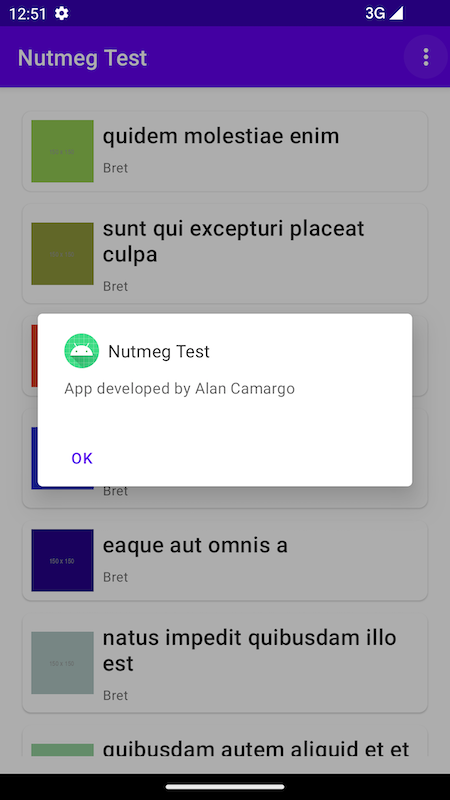
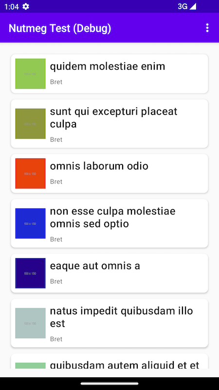

# Nutmeg Coding Test
Alan Camargo - Senior Android Engineer

## Summary
Using the free Typicode test API, this app gets a list of albums and displays them in a list
with the thumbnail of their first photo, the title and the creator's user name.

## Engineering
### Architecture
The app has been built using the MVVM and MVI architectural patterns. It is also modularised
as follows:

- `:app:`
    - Execution of the app
- `:core:`
    - Extension functions used across different modules
    - Network tools
    - Database tools
    - Logger
- `:core-design:`
    - All non-module-specific resources used across the app
    - UI helpers
- `:core-test:`
    - Unit test tools used across the app
    - Instrumented test tools used across the app
- `:feature-albums:`
    - Everything related specifically to the album list screen

### Dependency injection
Between Koin and Hilt, the chosen framework for this app has been Hilt because of the following
tradeoff:

**Koin**
|Pros|Cons|
|----|----|
|100% written in Kotlin|Dependency graph resolved at runtime|
|Easier to set up|Maintained by a single person (bus factor)|
|Less verbose||

**Hilt**
|Pros|Cons|
|----|----|
|Dependency graph resolved at compile time|Harder to set up|
|Maintained by Google|Very verbose - resembles Java|

The reason why Hilt has been chosen over Koin is that Koin's cons require a lot of extra and
unnecessary attention from the engineer(s) developing an app as they will have to worry about
whether their dependencies are all declared and injected properly and whether the framework
is still being maintained. Hilt's cons, on the other hand, are only a little inconvenience in
comparison.

## Screenshots
**Success state**
|Light mode|Dark mode|
|-------|------|
|||

**Dialogues**
App info and no results
|App info|No results|
|-------|------|
|||

Network and server errors
|Network error|Server error|
|-------|------|
|||

Generic error

**Loading state**

**Debug build**

## Known issues
The project has the following known issues:

- It takes too long to load the albums from the API because the endpoint doesn't allow filtering
the results (i.e.: fetching only the first photo of each album). This load time could be shorter
on the subsequent calls by fetching data from the cache but I decided to use the cache only as a
backup in case something goes wrong when calling the API, given the fact that this app simulates
a list of photo albums, which in real life is subject to frequent changes
- The project doesn't have a CI system
- The project doesn't have a static analysis system
